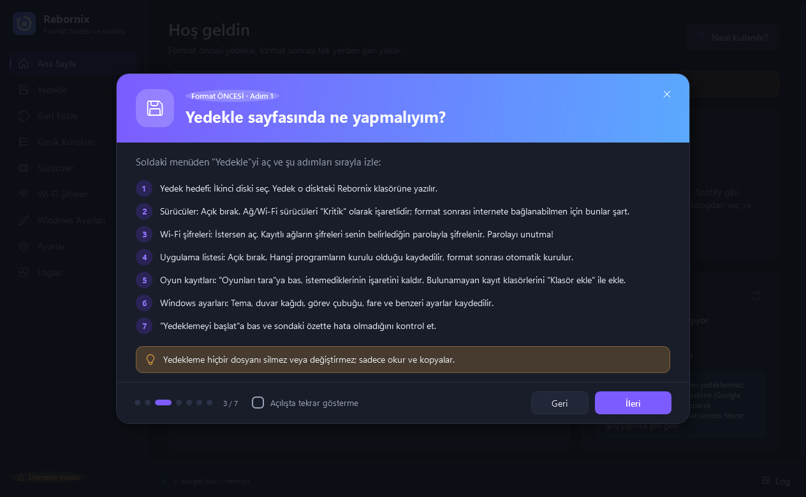
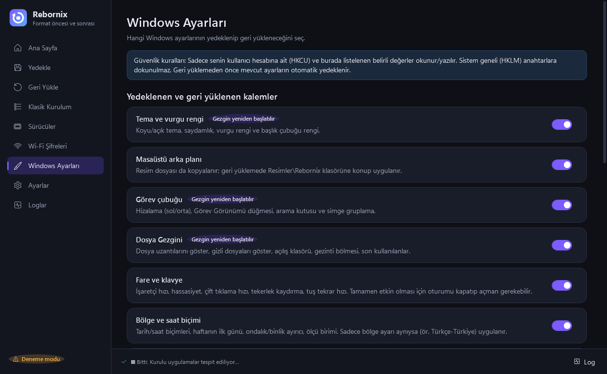

<p align="center">
  
</p>

<p align="center">
  <a href="https://github.com/Cafu1107/Rebornix/releases/latest"></a>
  
  
  
  <a href="LICENSE"></a>
</p>

<p align="center">
  <b>Format atmak artık bir günlük iş değil.</b><br>
  Rebornix sürücülerini, Wi-Fi şifrelerini, uygulamalarını, oyun kayıtlarını ve Windows ayarlarını formattan önce yedekler;<br>
  formattan sonra hepsini <b>doğru sırayla</b> geri kurar. Tek bir <code>.exe</code>, kurulum yok, tamamen Türkçe.
</p>

<p align="center">
  <a href="https://github.com/Cafu1107/Rebornix/releases/latest/download/Rebornix.exe">
    
  </a>
</p>

<p align="center">
  
</p>

---

## ✨ Neler yapıyor?

<table>
  <tr>
    <td width="33%" valign="top">
      <h3>💾 Yedekle</h3>
      <sub>Format ÖNCESİ</sub><br><br>
      Sürücüler · Wi-Fi şifreleri (parolayla şifreli) · kurulu uygulama listesi · oyun kayıtları · Windows ayarları — hepsi ikinci diske, tek klasöre.
    </td>
    <td width="33%" valign="top">
      <h3>♻️ Geri Yükle</h3>
      <sub>Format SONRASI</sub><br><br>
      <b>Sürücüler → Wi-Fi → Uygulamalar → Save'ler → Ayarlar.</b> Canlı durum, yeniden başlatmadan sonra kaldığı yerden devam, hatalıları tekrar dene.
    </td>
    <td width="33%" valign="top">
      <h3>📦 Klasik Kurulum</h3>
      <sub>Temiz bilgisayar</sub><br><br>
      Chrome, Steam, Discord, Spotify, VS Code… 60 popüler uygulamayı kartlardan seç, tek tıkla sessizce kur. Profil kaydet, tekrar kullan.
    </td>
  </tr>
</table>

| | |
|---|---|
| 🧭 **Adım adım rehber** | Uygulama ilk açıldığında formattan önce ve sonra ne yapman gerektiğini sayfa sayfa anlatır. |
| 🔐 **Güvenli Wi-Fi yedeği** | AES-256-GCM + PBKDF2 (600.000 tur). Şifreler hiçbir log'a yazılmaz, geçici dosyalar sıfırlanıp silinir. |
| 🛟 **Geri alınabilir** | Ayar geri yüklemeden önce otomatik anlık görüntü; tek tıkla eski haline dön. Sistem geri yükleme noktası önerisi. |
| 🧪 **Deneme modu** | Hiçbir şeyi değiştirmeden ne yapılacağını gösterir. |
| 🎮 **Oyun kayıtları** | [Ludusavi](https://github.com/mtkennerly/ludusavi) ile 10.000+ oyunun save'leri; kullanıcı adın değişse bile doğru yere döner. |
| 🧳 **Taşınabilir** | Ayarlar ve loglar exe'nin yanında. AppData'ya ve kayıt defterine kendi ayarını yazmaz. |

---

## 🖼️ Ekran görüntüleri

<table>
  <tr>
    <td></td>
    <td></td>
  </tr>
  <tr>
    <td align="center"><sub>Açılış rehberi — format öncesi</sub></td>
    <td align="center"><sub>Açılış rehberi — format sonrası</sub></td>
  </tr>
  <tr>
    <td></td>
    <td></td>
  </tr>
  <tr>
    <td align="center"><sub>Yedekle</sub></td>
    <td align="center"><sub>Geri Yükle</sub></td>
  </tr>
  <tr>
    <td></td>
    <td></td>
  </tr>
  <tr>
    <td align="center"><sub>Klasik Kurulum</sub></td>
    <td align="center"><sub>Windows Ayarları</sub></td>
  </tr>
</table>

---

## 🚀 Nasıl kullanılır?

### 0. Hazırlık
1. [`Rebornix.exe`](https://github.com/Cafu1107/Rebornix/releases/latest)'yi indir ve **ikinci diske** (ör. `D:\Rebornix\`), harici diske veya USB belleğe koy. **C: diskine koyma** — format atınca silinir.
2. Çift tıkla, yönetici iznine **Evet** de. İlk açılışta rehber seni adım adım yönlendirir.
3. İlk denemede **Ayarlar → Deneme modu**'nu açabilirsin.

### 1. Format ÖNCESİ — Yedekle
1. **Yedek hedefi**: ikinci diski seç (yedek `X:\Rebornix\` klasörüne yazılır, uygulama da oraya kopyalanır).
2. **Sürücüler** açık kalsın — ağ/Wi-Fi sürücüleri *"Kritik"* işaretlidir, format sonrası internet için şarttır.
3. **Wi-Fi şifreleri** — istersen aç, bir parola belirle (**unutma!**).
4. **Uygulama listesi** açık kalsın.
5. **Oyunları tara**, istemediklerini çıkar; gerekirse **özel klasör** ekle.
6. **Windows ayarları**nı seç → **Yedeklemeyi başlat** → özette hata olmadığını kontrol et.

> **Rebornix'in yedeklemediklerini sen yedekle:**
> - 📁 Masaüstü, Belgeler, Resimler, Videolar, Müzik, İndirilenler
> - 🌐 Tarayıcı şifreleri/yer imleri → tarayıcı hesabına giriş yapıp senkronizasyonu aç
> - 🔑 Authenticator yedek kodları, lisans anahtarları, BitLocker kurtarma anahtarı
> - 📨 Outlook `.pst` arşivleri, bulutta olmayan projeler

### 2. Format SONRASI — Geri Yükle
Yedek diskini tak, `Rebornix.exe`'yi aç, **Geri Yükle**'ye geç (yedek otomatik bulunur). Sırayla:

| # | Adım | Ne olur? |
|---|---|---|
| 1 | **Sürücüler** | Önce ağ sürücüleri, sonra diğerleri kurulur. Sistemde daha yeni sürüm varsa eskisi yazılmaz. Yeniden başlatma isterse başlat, Rebornix'i tekrar aç — kaldığı yerden devam eder. |
| 2 | **Wi-Fi** | Parolanı gir; ağların eklenir, internet kontrol edilir. |
| 3 | **Uygulamalar** | winget ile tek tek sessiz kurulum; kurulu olanlar atlanır. |
| 4 | **Save'ler** | Oyun platformlarına giriş yaptıktan sonra. Çakışmada *"Yeni olanı koru"* önerilir. |
| 5 | **Windows ayarları** | Önce otomatik geri alma kopyası alınır. |

Sonra: **Hatalıları tekrar dene**, *"Elle kurulması gerekenler"* listesine bak, Windows Update'i çalıştır, ekran kartı sürücüsünü üreticinin sitesinden güncelle.

### 3. Klasik Kurulum
Kartlardan seç → **Seçilenleri kur**. Kurulu olanlar *"Kurulu"* rozetiyle atlanır. Seçimini **profil** olarak kaydedebilirsin (ör. *Oyun PC'si*, *Minimal*).

---

## 🗂️ Klasör yapısı

```
Rebornix.exe
Drivers\           sürücü yedekleri (kategori klasörleri + drivers.json)
WiFi\              wifi.rbxenc (parolayla şifreli)
Data\              katalog.json, profiller.json, winget_apps.json, elle_kurulacaklar.json ...
Backups\           Ludusavi save yedekleri + özel klasörler
WindowsSettings\   ayar yedeği + _GeriAlma anlık görüntüleri
Logs\              Rebornix_YYYY-AA-GG.log
Tools\             ludusavi.exe (otomatik indirilir)
```

## ➕ Kataloğa uygulama eklemek (kod gerekmez)

`winget search <ad>` ile kimliği bul, `Data\katalog.json` içindeki `apps` listesine ekle:

```json
{ "name": "VLC Media Player", "id": "VideoLAN.VLC", "category": "Müzik ve Medya", "description": "Medya oynatıcı.", "default": false }
```

Kategoriler: `Tarayıcılar`, `Oyun`, `Müzik ve Medya`, `İletişim`, `Geliştirme`, `Araçlar`, `Güvenlik`, `Ofis`. Microsoft Store uygulamaları için `"source": "msstore"` ekle.

---

## 🛡️ Güvenlik

- Yıkıcı her işlemden önce onay istenir; kullanıcı verisi kendiliğinden silinmez. Eski yedek silinmez, `_OncekiYedek_TARİH` klasörüne taşınır.
- Wi-Fi yedeği: AES-256-GCM, PBKDF2-HMAC-SHA256 600.000 tur, rastgele salt/nonce, başlık doğrulamalı. Yedek geri açılıp doğrulanmadan düz metin dosyalar silinmez; hata/iptalde bile temizlenir.
- Windows ayarları: yalnızca **HKCU** altında, kodda tek tek listelenmiş değerler. HKLM'ye dokunulmaz.
- Yol birleştirmede `..\` kaçışları engellenir; winget kimlikleri doğrulanır.

<details>
<summary><b>Windows ayarları: dahil edilen ve edilmeyen kalemler</b></summary>

**Dahil:** Tema ve vurgu rengi · Masaüstü arka planı (resim dahil) · Görev çubuğu · Dosya Gezgini · Fare ve klavye · Bölge ve saat biçimi (bölge aynıysa) · Kullanıcı ortam değişkenleri (PATH birleştirilir, üzerine yazılmaz)

| Eklenmeyen | Sebep |
|---|---|
| Varsayılan uygulamalar | DISM içe aktarma yalnızca yeni kullanıcıları etkiler; mevcut seçimler hash korumalı |
| Güç planları | Sistem geneli, yeni plan kimliği; Modern Standby'da desteklenmez |
| Dil / klavye düzenleri | Dil paketi indirmesi gerektirebilir |
| Widgets düğmesi | Windows 11 UCPD koruması |
| Sabitlenmiş uygulamalar | Belgelenmemiş, sürüme bağlı veri |
| İmleç teması | İmleç dosyaları eksik olabilir |
| Saat dilimi | Windows otomatik ayarlıyor |

</details>

---

## 🛠️ Geliştiriciler için

C# 12 · .NET 8 · WPF · MVVM ([CommunityToolkit.Mvvm](https://github.com/CommunityToolkit/dotnet)) · metinler `src/Rebornix/Resources/Strings.resx` (İngilizce için `Strings.en.resx` eklenebilir).

```bash
dotnet build
dotnet test      # 64 test; ayar testleri HKCU\Software\RebornixTest_* kum havuzuna yazar
dotnet publish src/Rebornix/Rebornix.csproj -c Release -r win-x64 --self-contained true \
  -p:PublishSingleFile=true -p:IncludeNativeLibrariesForSelfExtract=true -o publish
```

Ludusavi entegrasyon testleri için `RBX_LUDUSAVI_EXE` ortam değişkenini ayarla. İkon: `tools/make-icon.ps1`.

## 🙏 Teşekkürler

[winget](https://github.com/microsoft/winget-cli) · [Ludusavi](https://github.com/mtkennerly/ludusavi) (MIT, çalışma anında indirilir) · [CommunityToolkit.Mvvm](https://github.com/CommunityToolkit/dotnet)

<p align="center"><sub>MIT Lisansı · Cafu1107</sub></p>
