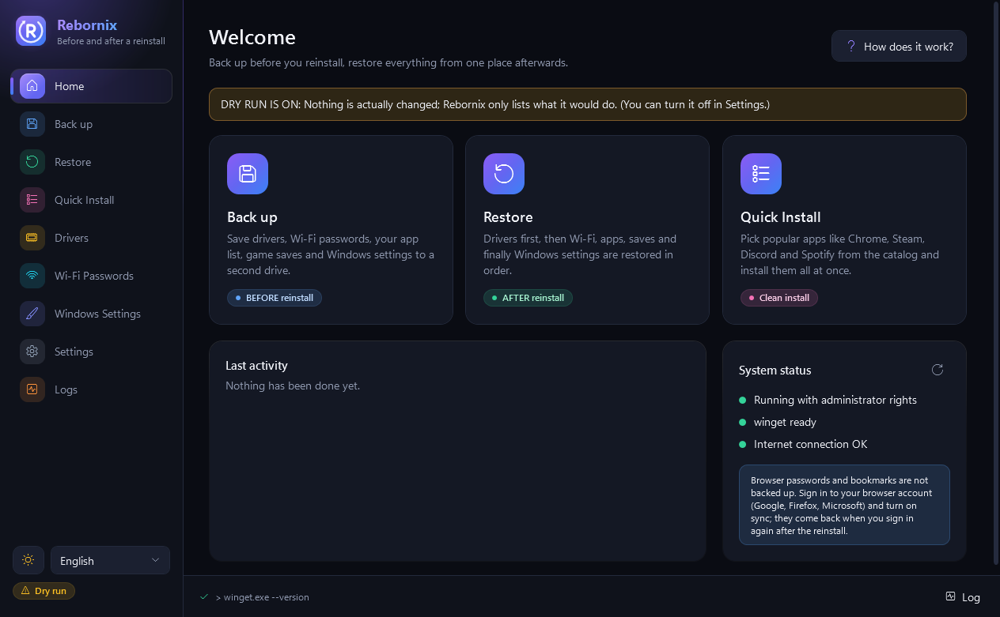
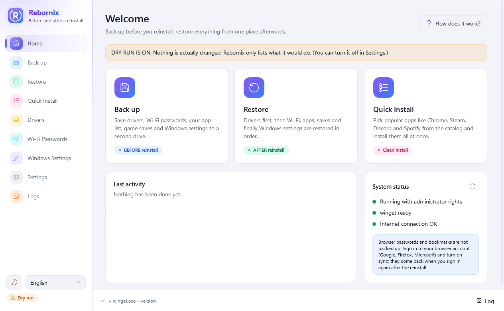
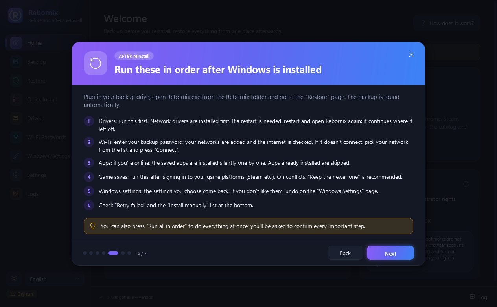

<p align="center">
  <b>English</b> · <a href="README.tr.md">Türkçe</a>
</p>

<p align="center">
  
</p>

<p align="center">
  <a href="https://github.com/Cafu1107/Rebornix/releases/latest"></a>
  <a href="https://github.com/Cafu1107/Rebornix/actions/workflows/ci.yml"></a>
  
  
  
</p>

<h3 align="center">About to reinstall Windows? Run Rebornix first.</h3>

<p align="center">
  Rebornix saves your drivers, Wi-Fi passwords, apps, game saves and Windows settings <b>before you reinstall</b>,<br>
  then brings everything back <b>in the right order</b> afterwards. You just press the buttons.
</p>

<br>

## 🟣 What do I do now? (3 steps)

> **In short:** download **one file**, `Rebornix.exe`, with the purple button below. There's nothing to install; the file you download *is* the app.

<p align="center">
  <a href="https://github.com/Cafu1107/Rebornix/releases/latest/download/Rebornix.exe">
    
  </a>
</p>

### 1️⃣ Download

Click **"DOWNLOAD Rebornix.exe"** above. The file lands in your Downloads folder.

> ⚠️ On the release page you'll also see **"Source code (zip)"** and **"Source code (tar.gz)"**. **Don't download those**, they're for developers. All you need is **`Rebornix.exe`**.

### 2️⃣ Put it in the right place

Move `Rebornix.exe` somewhere **that won't be wiped** by the reinstall:

| ✅ Put it here | ❌ Not here |
|---|---|
| A second drive (e.g. **D:**) | The **C:** drive (including Desktop, Documents, Downloads) |
| An external drive | A reinstall wipes everything there, including your backup! |
| A USB stick (16 GB or more recommended) | |

> 💡 Example: create a folder called **Rebornix** on your `D:` drive and put `Rebornix.exe` inside.

### 3️⃣ Double-click and follow the guide

Windows may ask two things when you run it. Both are normal:

1. **A blue window** (*"Windows protected your PC"*): click **"More info"**, then **"Run anyway"**.
   <sub>The app is new and has no paid code-signing certificate, so Windows doesn't recognise it yet. This is not a virus warning.</sub>
2. **"Do you want to allow this app to make changes to your device?"**: click **Yes**.
   <sub>Administrator rights are needed to read drivers and Wi-Fi settings.</sub>

On first launch, a short animated **welcome screen** introduces Rebornix. You can switch the language (English, Türkçe, Deutsch) right there in the top-right corner. The last slide gives you two choices:
- **Get started**: jump into the app.
- **How does it work?**: opens a **step-by-step guide** to what to do before and after reinstalling. You can open it again any time with the **"How does it work?"** button on the Home page. 🎉

<table>
  <tr>
    <td></td>
    <td></td>
  </tr>
  <tr>
    <td></td>
    <td></td>
  </tr>
</table>

---

## ✨ What it does

<table>
  <tr>
    <td width="33%" valign="top">
      <h3>💾 Back up</h3>
      <sub>BEFORE reinstalling</sub><br><br>
      Drivers · Wi-Fi passwords (password-encrypted) · list of installed apps · game saves · Windows settings, all in one folder on a second drive.
    </td>
    <td width="33%" valign="top">
      <h3>♻️ Restore</h3>
      <sub>AFTER reinstalling</sub><br><br>
      <b>Drivers → Wi-Fi → Apps → Saves → Settings.</b> Live status, continues where it left off after a restart, and a retry button for anything that failed.
    </td>
    <td width="33%" valign="top">
      <h3>📦 Quick Install</h3>
      <sub>Clean PC</sub><br><br>
      Chrome, Steam, Discord, Spotify, VS Code… pick from 60 popular apps and install them silently in one click. Save your selection as a profile.
    </td>
  </tr>
</table>

| | |
|---|---|
| 🌍 **3 languages** | English, Türkçe and Deutsch. Switch any time; the window reloads instantly. |
| 🌗 **Dark & light mode** | Dark, light, or follow Windows. Quick toggle at the bottom of the sidebar. |
| 🧭 **Built-in guide** | Explains step by step what to do before and after reinstalling. |
| 🔐 **Encrypted Wi-Fi backup** | AES-256-GCM + PBKDF2 (600,000 rounds). Passwords are never logged. |
| 🛟 **Undoable** | An automatic snapshot before restoring settings; roll back in one click. System restore point offered. |
| 🧪 **Dry run** | Shows what would happen without changing anything. |
| 🎮 **Game saves** | [Ludusavi](https://github.com/mtkennerly/ludusavi) finds saves for 10,000+ games, restored to the right place even if your user name changes. |
| 🧳 **Portable** | Settings and logs live next to the exe. Nothing is written to AppData or the registry for the app itself. |

<p align="center">
  
  
</p>
<p align="center"><sub>Dark and light mode</sub></p>

---

## 🗓️ The whole process

```
   BEFORE REINSTALL                 REINSTALL                   AFTER REINSTALL
┌──────────────────────┐      ┌──────────────────┐      ┌──────────────────────────┐
│ Rebornix → Back up   │ ───▶ │ Install Windows  │ ───▶ │ Rebornix → Restore       │
│ + copy your personal │      │ (C: is wiped)    │      │ 1 Drivers → 2 Wi-Fi →    │
│   files yourself     │      │                  │      │ 3 Apps → 4 Saves →       │
└──────────────────────┘      └──────────────────┘      │ 5 Settings               │
                                                        └──────────────────────────┘
```

### 🅰️ BEFORE reinstalling

**1. Open the "Back up" page in Rebornix:**

| What to do | Why |
|---|---|
| Pick your second drive / USB stick as the **backup target** | The backup goes into a `Rebornix` folder there |
| Leave **Drivers** on | You need the network driver to get online after the reinstall |
| Turn on **Wi-Fi passwords** if you like and choose a password | Your Wi-Fi passwords are saved. **Don't forget the password!** |
| Leave **App list** on | Rebornix remembers which programs are installed and reinstalls them for you |
| Press **Scan games** | Your game saves are found and copied |
| Press **Start backup** | Check that the summary at the end says "No errors ✓" |

<p align="center"></p>

**2. Copy these YOURSELF** (Rebornix doesn't touch them):

- [ ] 📁 **Personal files**: Desktop, Documents, Pictures, Videos, Music, Downloads → drag them to a second or external drive
- [ ] 🌐 **Browser**: sign in to Chrome / Edge / Firefox and **turn on sync** (that's how passwords and bookmarks come back)
- [ ] 🔑 **Passwords**: make sure you know your important passwords and have your authenticator (2FA) backup codes
- [ ] 🧾 **Licenses**: note down Office and other paid software license keys
- [ ] 🔒 **BitLocker**: if you use it, save your recovery key

**3. Check the backup folder.** If you see **Rebornix.exe, Drivers, WiFi, Data, Backups** in a folder like `D:\Rebornix`, you're ready. ✅

### 🅱️ During the reinstall

Install Windows. Format **only the C: drive**; leave the drive with your backup alone. If you used an external drive, unplugging it before the reinstall is the safest option.

### 🅲 AFTER reinstalling

1. Plug in your backup drive (or open D:) and double-click **`Rebornix\Rebornix.exe`**.
2. Go to the **Restore** page. Your backup is **found automatically**.
3. Press **"Run all in order"** (or run the steps one by one):

| # | Step | Good to know |
|:---:|---|---|
| 1 | 🔧 **Drivers** | Always first. If Windows asks for a restart, restart and open Rebornix again; **it continues where it left off**. |
| 2 | 📶 **Wi-Fi** | Asks for the password you set during backup, adds your networks and checks the internet. |
| 3 | 📦 **Apps** | Your programs are downloaded and installed silently one by one. It takes a while; grab a coffee. ☕ |
| 4 | 🎮 **Game saves** | Best run after signing in to Steam and other game platforms. |
| 5 | 🎨 **Windows settings** | Brings back your theme, wallpaper, taskbar and more. Don't like it? Undo it. |

<p align="center"></p>

4. Look at the bottom of the page:
   - **Retry failed**: if something couldn't be installed
   - **Install manually**: programs Rebornix can't install automatically; download them from the maker's website
5. Finally run **Windows Update** and update your graphics driver from the manufacturer's site (NVIDIA / AMD / Intel).

### ➕ Just want to install apps?

Open **Quick Install**, click the cards of the apps you want (Chrome, Steam, Discord, Spotify, VLC… 60 apps) and press **Install selected**. Apps already on the PC are marked **"Installed"** and skipped.

<p align="center"></p>

---

## ❓ FAQ

<details>
<summary><b>Do I need to install .NET or anything else?</b></summary>

No. `Rebornix.exe` carries everything with it. It runs straight away on a fresh Windows 10/11 (64-bit).
</details>

<details>
<summary><b>Windows says "Windows protected your PC", or my antivirus warns</b></summary>

The app is new and has no paid code-signing certificate, so Windows doesn't know it yet. Click **"More info" → "Run anyway"**. All source code is public here, and every release includes a `.sha256` file so you can verify the download (see Security below).
</details>

<details>
<summary><b>I want to try it first. Can it break anything?</b></summary>

Turn on **Settings → Dry run**. Rebornix then changes nothing and only lists what it would do. It also asks before every important step and never deletes your files on its own.
</details>

<details>
<summary><b>How do I change the language or switch to light mode?</b></summary>

Use the language box and the sun/moon button at the bottom of the left sidebar, or **Settings → Language / Appearance**. The window reloads instantly and keeps you on the same page.
</details>

<details>
<summary><b>Where is my backup stored?</b></summary>

In the `Rebornix` folder on the drive you chose:

```
Rebornix.exe        ← the app (open this after reinstalling)
Drivers\            drivers
WiFi\wifi.rbxenc    encrypted Wi-Fi backup
Data\               app list, settings
Backups\            game saves
WindowsSettings\    Windows settings
Logs\               activity logs
```
</details>

<details>
<summary><b>I forgot my Wi-Fi backup password</b></summary>

Unfortunately the backup can't be opened; that's deliberate, so nobody who gets your drive can read your passwords. You'll need to connect to your Wi-Fi manually. The other steps aren't affected.
</details>

<details>
<summary><b>Why aren't my browser passwords backed up?</b></summary>

For security. The safest way is to sign in to your browser account and turn on sync; everything comes back when you sign in again after reinstalling.
</details>

---

## 🛡️ Security

- 🔐 Wi-Fi passwords are encrypted with **AES-256** using your password. Your password is never stored, and passwords are never written to logs.
- 🛟 Before restoring Windows settings, your current settings are copied automatically; go back in one click under **Windows Settings → Undo points**.
- ✋ Every important step (installing drivers, changing settings) asks for confirmation first and offers to create a **System Restore point**.
- 🧳 Portable: the app keeps its own settings only in its own folder.
- 🧾 Every release includes `Rebornix.exe.sha256`. Run `Get-FileHash Rebornix.exe` in PowerShell and compare the result with that file to make sure your download wasn't altered. The exe is built from the public source code by GitHub Actions.

<details>
<summary><b>Technical details: which Windows settings are backed up?</b></summary>

**Included:** Theme and accent color · Desktop background · Taskbar · File Explorer · Mouse and keyboard · Region and time format · User environment variables (PATH is merged, never overwritten). Only specific values that belong to your user account (HKCU) are read/written.

| Deliberately not included | Why |
|---|---|
| Default apps | Windows protects the current user's choices, so they can't be restored reliably |
| Power plans | System-wide, not supported on some devices |
| Language / keyboard layouts | May require downloading language packs |
| Widgets button | Locked by Windows 11 |
| Pinned apps | Can break the Start menu |
| Cursor scheme | Cursor files may be missing |
| Time zone | Windows sets it automatically |

Wi-Fi encryption: AES-256-GCM, PBKDF2-HMAC-SHA256 (600,000 rounds), random salt and nonce. Temporary plain-text files are zeroed and deleted once the backup has been verified.
</details>

---

<details>
<summary><b>🛠️ For developers</b></summary>

C# 12 · .NET 8 · WPF · MVVM ([CommunityToolkit.Mvvm](https://github.com/CommunityToolkit/dotnet)).

```bash
dotnet build
dotnet test      # settings tests write only to HKCU\Software\RebornixTest_* (sandbox)
dotnet publish src/Rebornix/Rebornix.csproj -c Release -r win-x64 --self-contained true \
  -p:PublishSingleFile=true -p:IncludeNativeLibrariesForSelfExtract=true -o publish
```

**Translations:** UI text lives in `src/Rebornix/Resources/i18n/en.txt`, `tr.txt` and `de.txt` (one `Key=Value` per line). Run `tools/gen-resx.ps1` to regenerate the `.resx` files; it fails if a language is missing a key or a `{0}` placeholder. To add a language, copy `en.txt` to e.g. `fr.txt`, translate it, and add the code to `Loc.Supported`.

**Themes:** colors are in `Themes/Colors.Dark.xaml` and `Themes/Colors.Light.xaml` (same keys, checked by a test); styles in `Themes/Styles.xaml`.

**Adding apps to the catalog:** find the ID with `winget search <name>` and add it to `apps` in `Data\catalog.json` (no code needed):

```json
{ "name": "VLC Media Player", "id": "VideoLAN.VLC", "category": "Media", "default": false,
  "description": "Media player.", "description_tr": "Medya oynatıcı.", "description_de": "Mediaplayer." }
```

Categories: `Browsers`, `Gaming`, `Media`, `Communication`, `Development`, `Utilities`, `Security`, `Office` (any other name becomes a new category).

**Releasing:** bump `<Version>` in `Rebornix.csproj`, then `git tag v1.4.0 && git push origin v1.4.0`. GitHub Actions builds the exe and uploads it with its SHA256 hash.

Ludusavi integration tests need the `RBX_LUDUSAVI_EXE` environment variable. Icon: `tools/make-icon.ps1`.
</details>

## 🙏 Thanks

[winget](https://github.com/microsoft/winget-cli) (app installs) · [Ludusavi](https://github.com/mtkennerly/ludusavi) (game saves, downloaded automatically) · [CommunityToolkit.Mvvm](https://github.com/CommunityToolkit/dotnet)

<p align="center"><sub>MIT License · Cafu1107</sub></p>
