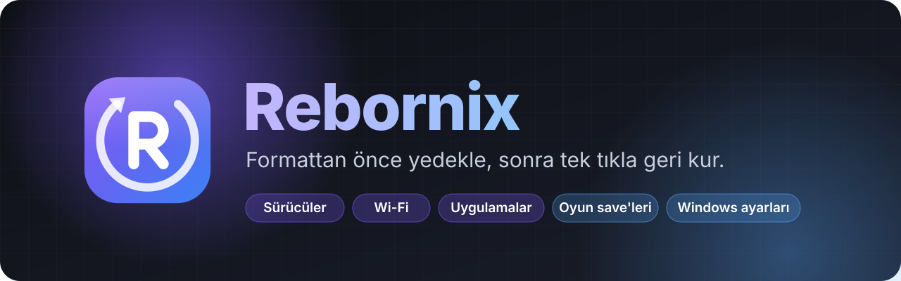
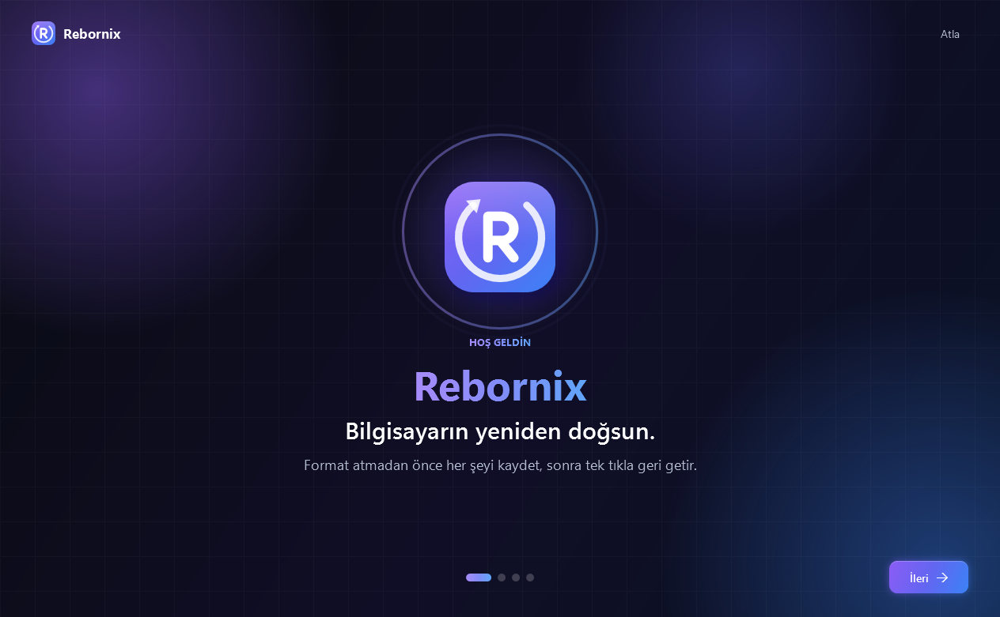
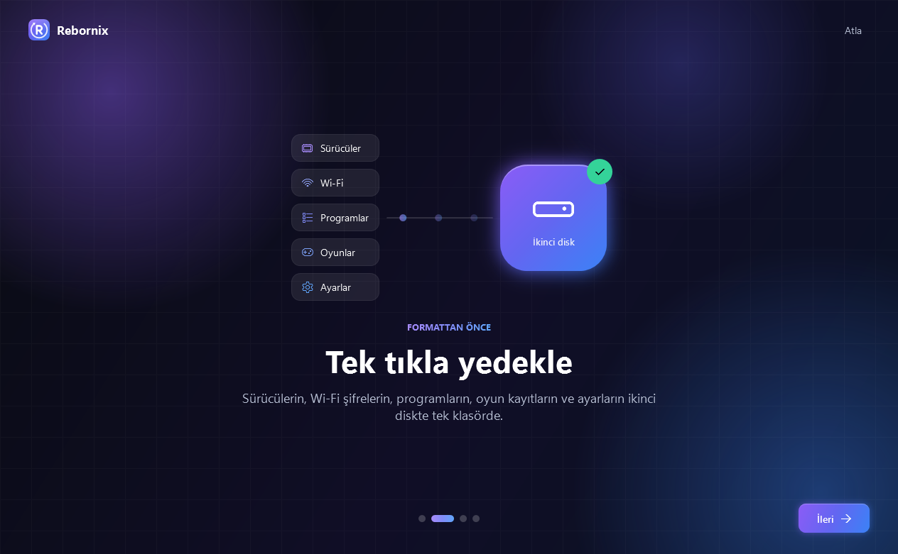
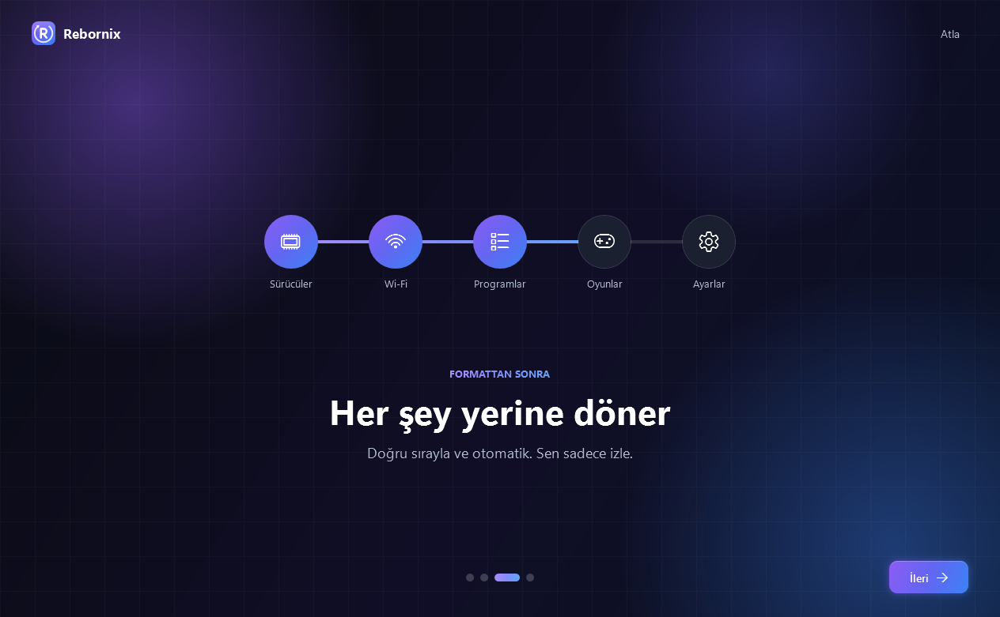
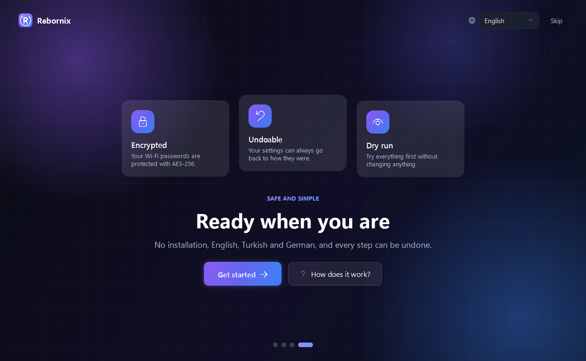
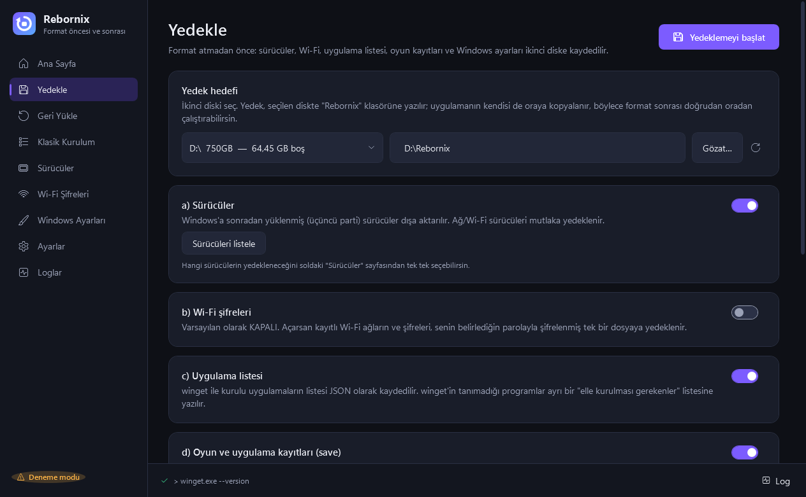
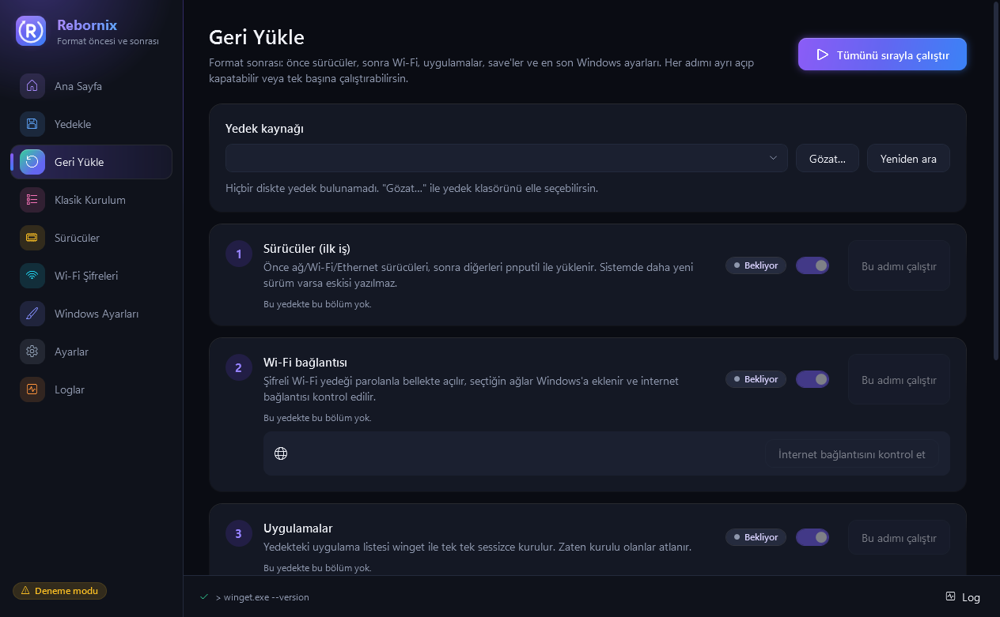
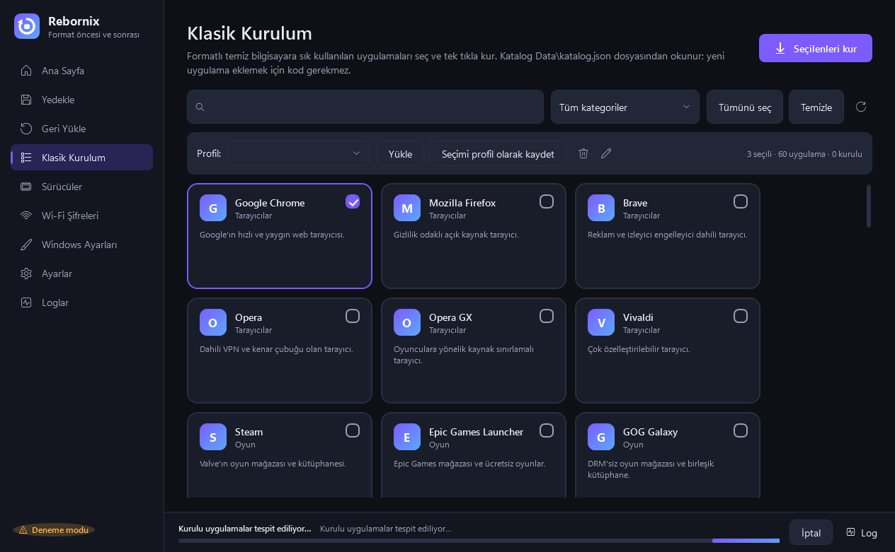

<p align="center">
  
</p>

<p align="center">
  <a href="https://github.com/Cafu1107/Rebornix/releases/latest"></a>
  <a href="https://github.com/Cafu1107/Rebornix/actions/workflows/ci.yml"></a>
  
  
  
</p>

<h3 align="center">Bilgisayarına format atacaksan, önce Rebornix'i çalıştır.</h3>

<p align="center">
  Sürücülerini, Wi-Fi şifrelerini, programlarını, oyun kayıtlarını ve Windows ayarlarını <b>formattan önce</b> kaydeder.<br>
  Format bitince hepsini <b>tek tek, doğru sırayla</b> geri kurar. Sen sadece düğmelere basarsın.
</p>

<br>

## 🟣 Şu an ne yapmalıyım? (3 adım)

> **Kısaca:** Aşağıdaki mor düğmeden **tek bir dosya** indireceksin: `Rebornix.exe`. Kurulum yok; indirdiğin dosya programın kendisi.

<p align="center">
  <a href="https://github.com/Cafu1107/Rebornix/releases/latest/download/Rebornix.exe">
    
  </a>
</p>

### 1️⃣ İndir

Yukarıdaki **"Rebornix.exe İNDİR"** düğmesine tıkla. Dosya İndirilenler klasörüne iner.

> ⚠️ Sürüm sayfasında **"Source code (zip)"** ve **"Source code (tar.gz)"** adlı dosyalar da görürsün. **Bunları indirme**, onlar yazılımcılar için. Sana lazım olan sadece **`Rebornix.exe`**.

### 2️⃣ Doğru yere koy

`Rebornix.exe` dosyasını **format atılmayacak bir yere** taşı:

| ✅ Buraya koy | ❌ Buraya koyma |
|---|---|
| İkinci disk (ör. **D:**) | **C:** diski (Masaüstü, Belgeler, İndirilenler dahil) |
| Harici disk | Format atınca her şey silinir, yedeğin de gider! |
| USB bellek (en az 16 GB önerilir) | |

> 💡 Örnek: `D:` diskinde **Rebornix** adında bir klasör aç, `Rebornix.exe`'yi içine koy.

### 3️⃣ Çift tıkla ve rehberi takip et

Çalıştırınca Windows iki şey sorabilir, ikisi de normal:

1. **Mavi bir pencere çıkarsa** (*"Windows kişisel bilgisayarınızı korudu"*): **"Ek bilgi"** yazısına tıkla, sonra **"Yine de çalıştır"**'a bas.
   <sub>Program yeni ve dijital imzası olmadığı için Windows tanımıyor; bu bir virüs uyarısı değil.</sub>
2. **"Bu uygulamanın cihazınızda değişiklik yapmasına izin veriyor musunuz?"** sorusuna **Evet** de.
   <sub>Sürücüleri ve Wi-Fi ayarlarını okuyabilmesi için yönetici izni gerekiyor.</sub>

Program ilk açılışta seni kısa, animasyonlu bir **karşılama ekranıyla** tanıştırır. Son sayfada iki seçenek var:
- **Hemen başla** → programa geçersin.
- **Nasıl kullanılır?** → formattan önce ve sonra ne yapman gerektiğini adım adım anlatan **rehber** açılır. Bu rehbere istediğin zaman Ana Sayfa'daki **"Nasıl kullanılır?"** düğmesinden de ulaşabilirsin. 🎉

<table>
  <tr>
    <td></td>
    <td></td>
  </tr>
  <tr>
    <td></td>
    <td></td>
  </tr>
</table>

---

## 🗓️ Format sürecinin tamamı

```
   FORMATTAN ÖNCE                    FORMAT                     FORMATTAN SONRA
┌──────────────────────┐      ┌──────────────────┐      ┌──────────────────────────┐
│ Rebornix → Yedekle   │ ───▶ │ Windows'u kur    │ ───▶ │ Rebornix → Geri Yükle    │
│ + kişisel dosyaların │      │ (C: silinir)     │      │ 1 Sürücü → 2 Wi-Fi →     │
│   kendin kopyala     │      │                  │      │ 3 Uygulama → 4 Save →    │
└──────────────────────┘      └──────────────────┘      │ 5 Ayarlar                │
                                                        └──────────────────────────┘
```

### 🅰️ Formattan ÖNCE

**1. Rebornix'te "Yedekle" sayfasını aç:**

| Ne yapacaksın | Neden |
|---|---|
| **Yedek hedefi** olarak ikinci diski / USB'yi seç | Yedek oraya, `Rebornix` klasörüne yazılır |
| **Sürücüler** açık kalsın | Format sonrası internete bağlanabilmek için ağ sürücüsü şart |
| **Wi-Fi şifreleri**'ni istersen aç ve bir parola belirle | Wi-Fi şifrelerin kaydedilir. **Parolayı unutma!** |
| **Uygulama listesi** açık kalsın | Hangi programların kurulu olduğu kaydedilir, sonra otomatik kurulur |
| **Oyunları tara**'ya bas | Oyun kayıtların (save) bulunur ve kopyalanır |
| **Yedeklemeyi başlat** | Sonunda çıkan özette "Hata yok ✓" yazdığını kontrol et |

<p align="center"></p>

**2. Bunları KENDİN kopyala** (Rebornix bunlara dokunmaz):

- [ ] 📁 **Kişisel dosyaların**: Masaüstü, Belgeler, Resimler, Videolar, Müzik, İndirilenler → ikinci diske/harici diske sürükle-bırak
- [ ] 🌐 **Tarayıcı**: Chrome / Edge / Firefox'ta hesabına giriş yap ve **senkronizasyonu aç** (şifreler ve yer imleri böyle geri gelir)
- [ ] 🔑 **Şifreler**: önemli hesaplarının şifrelerini ve Authenticator (iki adımlı doğrulama) yedek kodlarını bildiğinden emin ol
- [ ] 🧾 **Lisanslar**: Office ve ücretli programların lisans anahtarlarını not et
- [ ] 🔒 **BitLocker** kullanıyorsan kurtarma anahtarını kaydet

**3. Yedek klasörünü kontrol et.** `D:\Rebornix` gibi klasörde **Rebornix.exe, Drivers, WiFi, Data, Backups** görüyorsan hazırsın. ✅

### 🅱️ Format sırasında

Windows'u kur. Kurulumda **sadece C: diskini** biçimlendir; yedeğin olduğu diske dokunma. Harici disk kullandıysan formattan önce çıkarmak en güvenlisi.

### 🅲 Formattan SONRA

1. Yedek diskini tak (veya D:'yi aç), **`Rebornix\Rebornix.exe`**'yi çift tıkla.
2. **Geri Yükle** sayfasına geç. Yedeğin **otomatik bulunur**.
3. **"Tümünü sırayla çalıştır"**'a bas (veya adımları tek tek çalıştır):

| Sıra | Adım | Bilmen gereken |
|:---:|---|---|
| 1 | 🔧 **Sürücüler** | İlk iş budur. Bilgisayar yeniden başlatma isterse başlat, Rebornix'i tekrar aç; **kaldığı yerden devam eder**. |
| 2 | 📶 **Wi-Fi** | Yedeklerken belirlediğin parolayı sorar, ağlarını ekler, interneti kontrol eder. |
| 3 | 📦 **Uygulamalar** | Programların internetten tek tek, sessizce kurulur. Biraz sürebilir, çayını al. ☕ |
| 4 | 🎮 **Oyun kayıtları** | Steam gibi platformlara giriş yaptıktan sonra çalıştırman en iyisi. |
| 5 | 🎨 **Windows ayarları** | Temanı, duvar kağıdını, görev çubuğunu geri getirir. Beğenmezsen geri alabilirsin. |

<p align="center"></p>

4. Sayfanın en altına bak:
   - **Hatalıları tekrar dene**: kurulamayan bir şey olduysa
   - **Elle kurulması gerekenler**: Rebornix'in otomatik kuramadığı programlar; bunları üreticisinin sitesinden indir
5. Son olarak **Windows Update**'i çalıştır ve ekran kartı sürücüsünü üreticinin sitesinden (NVIDIA / AMD / Intel) güncelle.

### ➕ Sadece program kurmak istiyorsan

**Klasik Kurulum** sayfasını aç, istediğin programların kartlarına tıkla (Chrome, Steam, Discord, Spotify, VLC… 60 program), **Seçilenleri kur**'a bas. Bilgisayarda zaten olanlar **"Kurulu"** yazar ve atlanır.

<p align="center"></p>

---

## ❓ Sık sorulan sorular

<details>
<summary><b>.NET veya başka bir şey kurmam gerekiyor mu?</b></summary>

Hayır. `Rebornix.exe` her şeyi içinde taşır. Temiz kurulmuş Windows 10/11'de (64 bit) direkt çalışır.
</details>

<details>
<summary><b>Windows "bilgisayarınızı korudu" diyor ya da antivirüs uyarı veriyor</b></summary>

Program yeni ve ücretli bir dijital imzası olmadığı için Windows onu tanımıyor. **"Ek bilgi" → "Yine de çalıştır"** diyebilirsin. Kaynak kodun tamamı bu sayfada açık; istersen kendin inceleyebilir veya derleyebilirsin.
</details>

<details>
<summary><b>Önce denemek istiyorum, bir şeyi bozar mı?</b></summary>

**Ayarlar → Deneme modu**'nu aç. Bu modda Rebornix hiçbir şeyi değiştirmez, sadece ne yapacağını yazar. Ayrıca her önemli işlemden önce onay ister, hiçbir dosyanı kendiliğinden silmez.
</details>

<details>
<summary><b>Yedeğim nerede duruyor?</b></summary>

Seçtiğin diskte `Rebornix` klasöründe:

```
Rebornix.exe        ← program (format sonrası bunu aç)
Drivers\            sürücüler
WiFi\wifi.rbxenc    şifreli Wi-Fi yedeği
Data\               uygulama listesi, ayarlar
Backups\            oyun kayıtları
WindowsSettings\    Windows ayarları
Logs\               işlem kayıtları
```
</details>

<details>
<summary><b>Wi-Fi yedeği parolasını unuttum</b></summary>

Maalesef yedek açılamaz; bu, başkası diskini alırsa şifrelerini okuyamasın diye bilinçli bir güvenlik önlemi. Wi-Fi ağlarına elle bağlanman gerekir. Diğer adımlar etkilenmez.
</details>

<details>
<summary><b>Tarayıcı şifrelerimi neden yedeklemiyor?</b></summary>

Güvenlik nedeniyle. En güvenli yol, tarayıcında hesabına giriş yapıp senkronizasyonu açmak; format sonrası tekrar giriş yapınca her şey geri gelir.
</details>

<details>
<summary><b>Rehberi tekrar görmek istiyorum</b></summary>

Ana Sayfa'nın sağ üstündeki **"Nasıl kullanılır?"** düğmesine bas.
</details>

---

## 🛡️ Güvenlik

- 🔐 Wi-Fi şifreleri **AES-256** ile, senin parolanla şifrelenir. Parolan hiçbir yere kaydedilmez, şifreler log dosyalarına yazılmaz.
- 🛟 Windows ayarlarını geri yüklemeden önce mevcut ayarların otomatik kopyalanır; **Windows Ayarları → Geri alma noktaları**'ndan tek tıkla eski haline dönebilirsin.
- ✋ Sürücü yükleme, ayar değiştirme gibi her önemli adımdan önce onay ister ve **Sistem Geri Yükleme noktası** oluşturmayı önerir.
- 🧳 Taşınabilir: kendi ayarlarını sadece kendi klasöründe tutar.
- 🧾 Her sürümde `Rebornix.exe.sha256` dosyası var. İndirdiğin dosyanın değiştirilmediğini PowerShell'de `Get-FileHash Rebornix.exe` yazıp çıkan değeri bu dosyadakiyle karşılaştırarak kontrol edebilirsin. Exe, GitHub Actions tarafından açık kaynak koddan derlenir.

<details>
<summary><b>Teknik ayrıntılar: hangi Windows ayarları yedekleniyor?</b></summary>

**Yedeklenenler:** Tema ve vurgu rengi · Masaüstü arka planı · Görev çubuğu · Dosya Gezgini · Fare ve klavye · Bölge ve saat biçimi · Kullanıcı ortam değişkenleri (PATH birleştirilir, üzerine yazılmaz). Sadece kullanıcı hesabına ait (HKCU) ve tek tek belirlenmiş değerler okunur/yazılır.

| Bilerek yedeklenmeyen | Sebep |
|---|---|
| Varsayılan uygulamalar | Windows mevcut kullanıcının seçimlerini koruma altında tutuyor, güvenilir geri yüklenemiyor |
| Güç planları | Sistem geneli, bazı cihazlarda desteklenmiyor |
| Dil / klavye düzenleri | Dil paketi indirmesi gerektirebilir |
| Widgets düğmesi | Windows 11 bu ayarı kilitliyor |
| Sabitlenmiş uygulamalar | Başlat menüsünü bozabilir |
| İmleç teması | İmleç dosyaları eksik olabilir |
| Saat dilimi | Windows otomatik ayarlıyor |

Wi-Fi şifreleme: AES-256-GCM, PBKDF2-HMAC-SHA256 (600.000 tur), rastgele salt ve nonce. Geçici düz metin dosyalar yedek doğrulandıktan sonra sıfırlanıp silinir.
</details>

---

<details>
<summary><b>🛠️ Yazılımcılar için</b></summary>

C# 12 · .NET 8 · WPF · MVVM ([CommunityToolkit.Mvvm](https://github.com/CommunityToolkit/dotnet)). Arayüz metinleri `src/Rebornix/Resources/Strings.resx` dosyasında (İngilizce için `Strings.en.resx` eklenebilir).

```bash
dotnet build
dotnet test      # 64 test; ayar testleri HKCU\Software\RebornixTest_* kum havuzuna yazar
dotnet publish src/Rebornix/Rebornix.csproj -c Release -r win-x64 --self-contained true \
  -p:PublishSingleFile=true -p:IncludeNativeLibrariesForSelfExtract=true -o publish
```

**Kataloğa program eklemek:** `winget search <ad>` ile kimliği bul, `Data\katalog.json` içindeki `apps` listesine ekle (kod gerekmez):

```json
{ "name": "VLC Media Player", "id": "VideoLAN.VLC", "category": "Müzik ve Medya", "description": "Medya oynatıcı.", "default": false }
```

**Yeni sürüm çıkarmak:** `Rebornix.csproj` içindeki `<Version>` değerini artır, sonra `git tag v1.4.0 && git push origin v1.4.0`. GitHub Actions exe'yi derleyip SHA256 özetiyle birlikte sürüme yükler.

Ludusavi entegrasyon testleri için `RBX_LUDUSAVI_EXE` ortam değişkeni gerekir. İkon: `tools/make-icon.ps1`.
</details>

## 🙏 Teşekkürler

[winget](https://github.com/microsoft/winget-cli) (program kurulumu) · [Ludusavi](https://github.com/mtkennerly/ludusavi) (oyun kayıtları, otomatik indirilir) · [CommunityToolkit.Mvvm](https://github.com/CommunityToolkit/dotnet)

<p align="center"><sub>MIT Lisansı · Cafu1107</sub></p>
